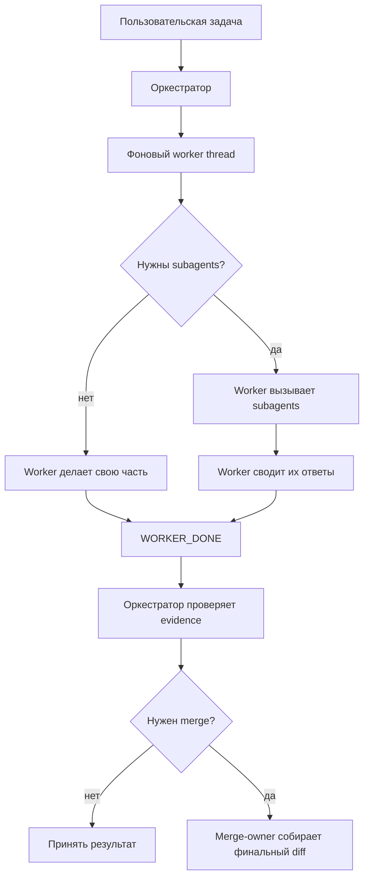
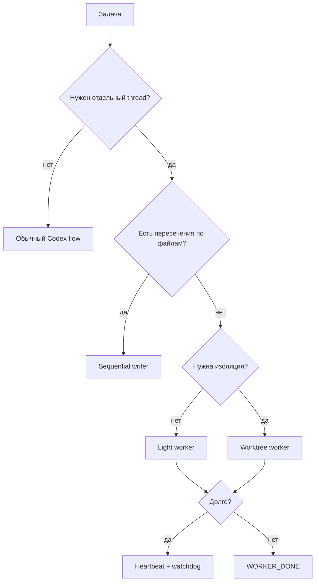
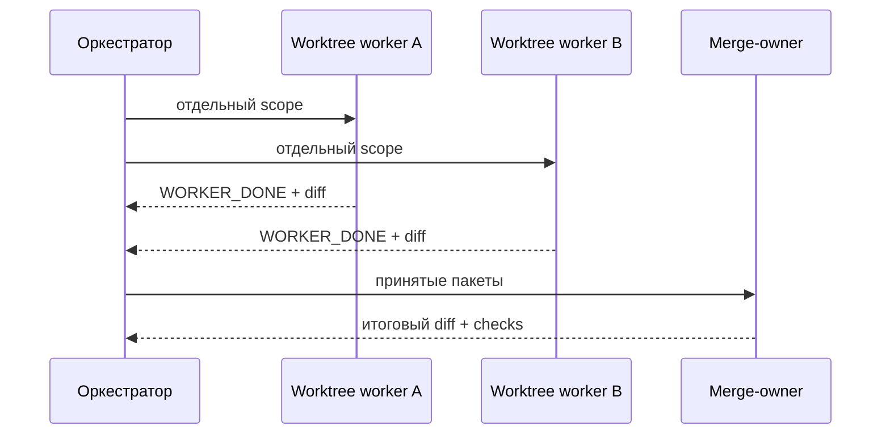

# Codex Skill: Фоновые Треды

Неофициальный Codex skill для фоновых тредов: главный тред остаётся
оркестратором, воркеры работают отдельно, присылают `WORKER_DONE`, а при
нужде их результаты сводит merge-owner.

Не для обычных same-thread subagents.

## Когда Нужен

- несколько независимых пишущих агентов;
- долгие задачи с heartbeat/watchdog;
- воркер должен сам вызвать subagents;
- worktree-воркеры потом сливаются в один результат.

## Установка

```sh
mkdir -p ~/.codex/skills
git clone https://github.com/triton2030/codex-bg-threads-skill.git ~/.codex/skills/1codex-bg-threads
```

Запрос:

```text
Use $1codex-bg-threads for explicit background workers with heartbeat and WORKER_DONE stop signals.
```

## Как Это Работает



## Выбор Режима



## Слияние Worktree



## Правила

- Один worker: один outcome и один write scope.
- Parallel только при независимых scope.
- Worktree и merge-owner: инструменты безопасности, не ритуал.
- Heartbeat доказывает жизнь, не качество.
- `WORKER_DONE` принимается только после diff, checks и evidence.

## Файлы

- `SKILL.md`: короткий router и контракт.
- `references/templates.md`: prompt-блоки.
- `references/codex-facts.md`: факты Codex и ссылки.
- `references/worktree-merge.md`: fanout -> merge-owner.
- `agents/openai.yaml`: опциональные метаданные.

## Лицензия

MIT.
